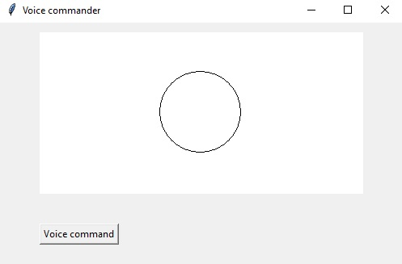

# Voice_controlled_drawing_interface

A deep neural network that recognizes voice commands embedded into a small user interface. 

# App possibilities

There are 5 default controlls ['izbrisi', 'krug', 'kvadrat', 'oboji', 'trougao'](in serbian) or ['clear', 'circle', 'square', 'color', 'triangle'](translation). 
The circle, square, triangle commands draw the corresponding shapes. The color command colors the corresponding shapes in a random color. 
The clear command clears the screen. There is a "Voice command" button which records input from the microphone for 2s, and then the recognized 
action is executed. Keep in mind that the neural network was recognized on my voice samples (11 for each command), so it might not perform good 
on you own voice.

### "Circle"

### "Color"

### "Color"

### "Triangle"

### "Square"

### "Clear"

